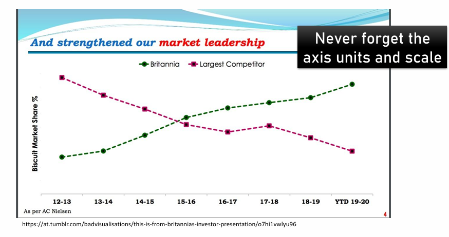
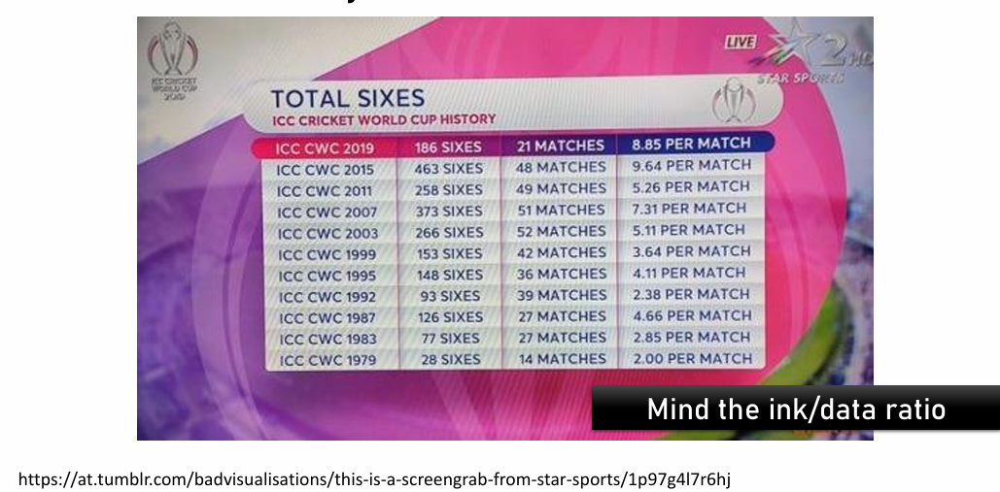
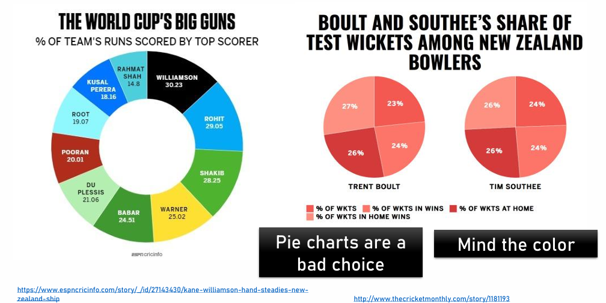
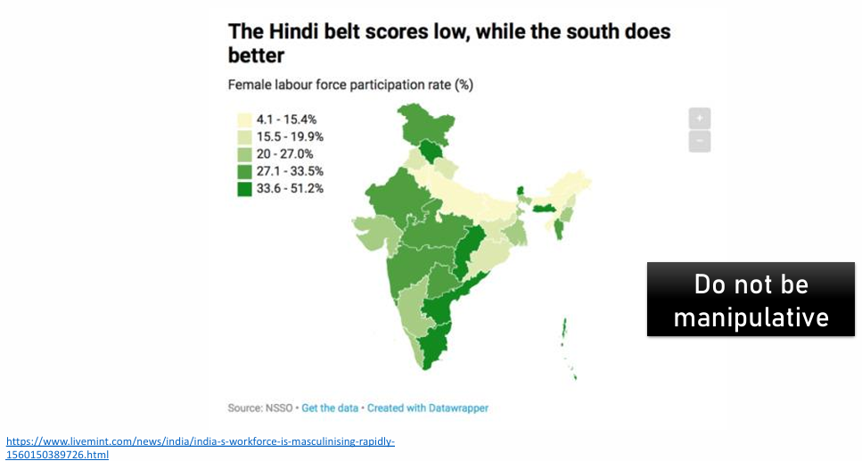
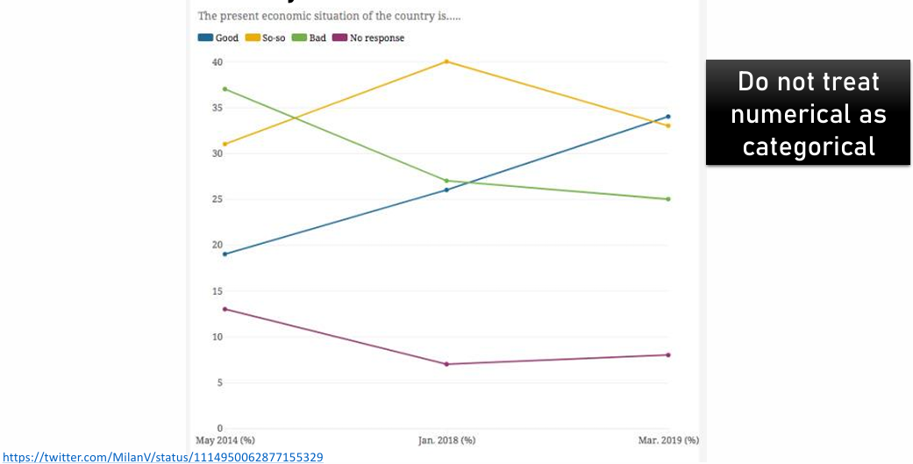
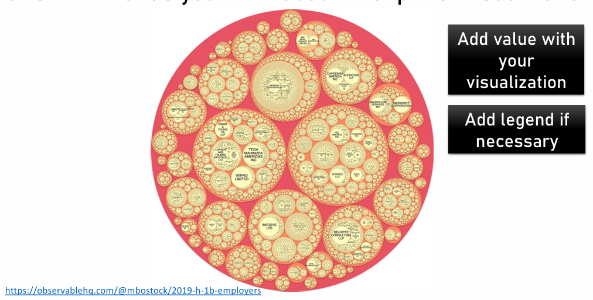
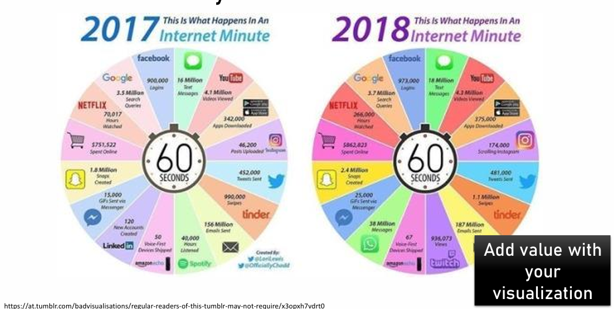
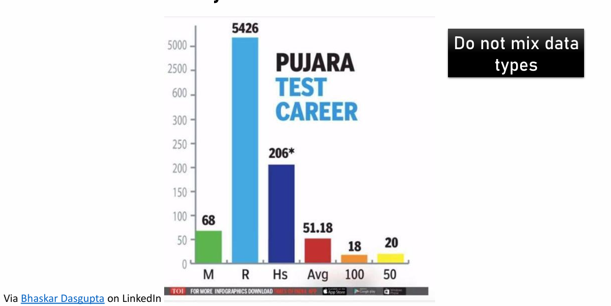

## 0. Overview of this practical

In this session we will cover:

-   Data visualisation is an art. What makes a good visualisation?
-   How long will my red kite live? (*i.e.* How can we use R to quickly understand the centrality and variation of a variable?)

## 1. The art of data visualisation

Data visualization in biology is extremely necessary (Wong, 2012: <https://www.nature.com/articles/nmeth.2258.pdf?origin=ppub>), but it is an art discipline itself. Please take a dive in this portal to explore the potential of data visualizations and explore at least one visualization type: <https://datavizproject.com/>. Remember you can find R code to prepare those graph types here: <https://r-graph-gallery.com/>.

## 2. Data visualisation objectives

Non-exclusive data visualization aims:

-   **Communicate**: Communicate an idea or a result of an analysis. Impactful visualizations communicate more efficiently.

-   **Explore**: Exploratory data analysis (EDA) benefits from data visualization as they help understand the nature and characteristics of a variable set. Interactive visualizations are very useful to explore better the data following successive questioning.

-   **Data in its context**: understand the value of a particular information within its context, for example a company’s number of total sells in a ranking.

-   **Find patterns and outliers**: find out of the range values and identify hidden patterns, for example seek seasonality dynamics or hidden maps.

## 3. How to create a good visualisation

-   **Define your Take Home Message (THM)**: this is the first step and must be considered carefully. Define what do you want to tell to your targeted audience. Are you trying to show a trend? Are you trying to find data outliers? Define the aim of your visualization and which question are you trying to answer. Writing the figure caption with a heading title may help on this process.

-   **Choose a plot type:** There are plenty of plot types, generally there are the following categories: those that **compare** data groups, define **distributions**, and .

-   **Draw by hand your plot**: This will help you coding the figure as will make you detail the elements that it must include.

-   **Prepare the data**: Do you need any extra information? Do you need perhaps to calculate the mean and standard error by group, or standarise the data?

-   **Pick aesthetic palette**: Consider color-blind palettes. Make your figure intuitive: if your colour scale is temperature pick a blue to red colour scale. Function is way more important than aesthetics.

-   Check that your are **not missing anything essential**: if it’s a map, does it have a scale? If the data has variation, have you included a way to represent it (standard error, jittered points, etc). If you’re showing something with colour or shape did you include a legend? Is the ink/information ratio balanced? Do not add ink to the plot that does not give extra information. The human eye is not prepared to compare areas and angles avoid pie charts.

-   **Code the figure**

-   **Test it** with friends, the plot must be autoexplanatory. Check the readability of the different elements and the logic of its disposition.

Remember, a good visualisation is: simple, effective, contains high information/low ink, intuitive, and **honest**.

> Good plots reduce thinking. Bad plots create the illusion of understanding.

## 4. Let's play: Is this a good visualisation?

**EXERCICE 1. Choose one** of the following plots, **describe** it and **justify** why or why not it is a good visualisations. How would you **improve** them?


















**EXERCICE 2**. There are multiple ways to build a plot with the same data. The dataset "diamonds" contains the price of a list of diamonds with different properties, such as their "cut". Google "diamond dataset R plot" and try to find the **worst visualisation**? Ask the student at your left and right if they agree with you.

> *Memes about visualisations: Accounts I personally love: "Terrible maps" in X, as well as "Amazing maps" in X. "Chartosaur" in IG, "Datastuffplus" in IG*

## 5. How long will my red kite live?

The aim of this final section is to learn to use R to quickly capture the centrality and variation of a variable. We will use R to calculate measurements of centrality and dispersion. But more importantly, how would you respond to the question: "How long will my red kite live?".

You are working with a conservation charity in the UK that monitors **red kites (*Milvus milvus*)**. After decades of decline, reintroduction programmes have been successful, and members of the public are now frequently seeing red kites soaring above their towns and countryside.

At public talks and outreach events, one question keeps coming up:

> **“How long will my red kite live?”**

This sounds like a simple question, but as scientists we know the answer is *not a single number*. Some red kites die young, others live surprisingly long lives. To communicate honestly with the public, we need to describe **both the typical lifespan and how much variation there is**.

In this section, you will use a real-world conservation scenario to learn how to **summarise a biological variable** — red kite longevity — using R. You will calculate measurements of **central tendency** (mean, median, mode) and **variation** (range, variance, standard deviation, quartiles, interquartile range, standard error, and confidence intervals).

By the end, you should be able to explain — in plain language — what the data say about red kite lifespan, and how confident we can be in our answer.


## The data: Red kite longevity

Suppose conservationists followed a group of red kites born in the same region of the UK and recorded how long each bird lived (in **years**).

```{r}
kite_longevity <- c(
  2, 3, 4, 5, 6, 7, 7, 8, 8, 9,

  9, 10, 10, 11, 11, 12, 12, 13, 14, 15,

  16, 18, 19, 20

)
```

Each number represents the lifespan of **one individual red kite**.

## Exercise 1 – First look at the data

1.  Look the vector `kite_longevity`.

```{r}
kite_longevity
```

1.  How many red kites are in this dataset?

*Hint:* use `length()`

```{r}
# Your code here
```

**Biological thinking:** Why might this sample *not* represent every red kite in the UK?

Take a look at these plots. Are these good visualisations?

```{r}
hist(kite_longevity, breaks = 30, col = "hotpink", main = "Kites!!!")

hist( kite_longevity, breaks = 8, col = "black",border = "white", main = "Distribution of red kite longevity",  xlab = "Lifespan (years)",  ylab = "Number of red kites")

boxplot(kite_longevity,horizontal = TRUE, main = "Red kite longevity",xlab = "Lifespan (years)",col = "lightblue")

stripchart(kite_longevity,method = "jitter",pch = 19, col = "darkgray",  xlab = "Lifespan (years)",main = "Red kite longevity (individual birds)")

boxplot(kite_longevity, horizontal = TRUE,col = "lightblue",main = "Red kite longevity with individual data", xlab = "Lifespan (years)")

stripchart( kite_longevity, method = "jitter",  pch = 19, col = "darkgray",  add = TRUE)

plot( kite_longevity, type = "l", main = "Red kite longevity",ylab = "Lifespan (years)", xlab = "Bird number")

hist( kite_longevity, breaks = 8, col = "#8B3A2E",main = "Mean and median red kite lifespan", xlab = "Lifespan (years)")
abline(v = mean(kite_longevity), col = "black", lwd = 2)
abline(v = median(kite_longevity), col = "darkgray", lwd = 2)
legend(  "topright",  legend = c("Mean", "Median"),  col = c("black", "darkgray"),  lwd = 2)

# Compute density
kite_density <- density(kite_longevity)
plot(  kite_density,  main = "Estimated distribution of red kite longevity",
  xlab = "Lifespan (years)",  ylab = "Density",  lwd = 2, col = "#8B3A2E")

# Add rug plot (individual data)
rug(kite_longevity)

plot(density(kite_longevity, bw = 1), lwd = 2, main = "Effect of smoothing on density estimation", xlab = "Lifespan (years)")
lines(density(kite_longevity, bw = 3), lwd = 2, lty = 2)
legend("topright",
       legend = c("Less smoothing", "More smoothing"),
       lwd = 2, lty = c(1, 2))

plot( density(kite_longevity, bw = 0.1),  col = "lightpink",lwd = 4,main = "Red kite longevity!!!")

hist( kite_longevity, breaks = 8,  col = "lightgray",  border = "white",  freq = FALSE,  main = "Distribution of red kite longevity",  xlab = "Lifespan (years)")
lines(  density(kite_longevity),  lwd = 2,  col = "#8B3A2E")

plot( ecdf(kite_longevity),  main = "Cumulative distribution of red kite longevity",  xlab = "Lifespan (years)",  ylab = "Proportion of red kites",  col = "#8B3A2E",  lwd = 2)

kite_density <- density(kite_longevity)

plot(  kite_density$y,  kite_density$x,  type = "l",  col = "#8B3A2E",  xlim = c(-0.02, 0.02),  xlab = "",  ylab = "Lifespan (years)",  main = "Violin-style view of red kite longevity")

lines( -kite_density$y,  kite_density$x,  col = "#8B3A2E")
hist_data <- hist(kite_longevity, plot = FALSE)

image(t(as.matrix(hist_data$counts)),  col = heat.colors(10),  axes = FALSE,  main = "Heatmap-style view of longevity frequency")
```

## Exercise 2 – Measures of central tendency

We want to describe what a *typical* lifespan looks like.

### 2.1 Mean lifespan

1.  Calculate the **mean** longevity.

*Hint:* use `mean()`

```{r}
# Your code here
```

**Question:** If someone asks “How long does a red kite live on average?”, which number are you giving them?

### 2.2 Median lifespan

1.  Calculate the **median** longevity.

*Hint:* use `median()`

```{r}
# Your code here
```

**Thinking:** Why/When might the median be a better answer than the mean when talking to the public?

### 2.3 Mode

The **mode** is the most common value.

1.  Look at the data and identify the mode *by inspection*.

2.  Is there a single mode or multiple modes?

> *Note:* The statistical software R does not have a built-in function to calculate the mode of a dataset, but we could build a function to calculate it. You will learn how to create functions next year.

**Thinking:** In biology, when is the mode useful, and when is it less informative?

## Exercise 3 – Measures of spread (variation)

A single number is not enough. Imagine telling the public that red kites live *10 years* — this sounds precise, but it hides an important truth. Some birds die very young, while others live much longer than 10 years. Two populations could have the same average lifespan but very different realities for individual birds. To describe longevity honestly, we must also explain **how spread out the lifespans are**: whether most red kites live close to the typical value, or whether lifespans vary widely. Measures of variation allow us to capture this biological diversity and avoid oversimplifying a complex natural process.

### 3.1 Range

1.  Find the **minimum** and **maximum** lifespan and calculate the range.

*Hints:* `min()`, `max()` or try also `range()`

```{r}
# Your code here

```

**Question:** Would it be misleading to say “red kites live between X and Y years”?

### 3.2 Variance and standard deviation

1.  Calculate the **variance**.

2.  Calculate the **standard deviation**.

*Hints:* `var()`, `sd()`

```{r}
# Your code here
```

**Interpretation:** What does a large standard deviation tell you about differences between individual birds?

### 3.3 Quartiles and interquartile range (IQR)

1.  Calculate the **quartiles**. What does the multiple numbers mean?

*Hint:* `quantile()`

```{r}
# Your code here
```

2.  Calculate the **interquartile range (IQR)**.

*Hint:* `IQR()`

```{r}
# Your code here
```

**Thinking:** Why is the IQR often preferred to the range when describing spread?

## Exercise 4 – Standard error and uncertainty

The **standard deviation** describes variation among individuals. The **standard error** describes uncertainty in the *mean*.

1.  Calculate the standard error of the mean lifespan.

*Hint:* sd(x) / sqrt(length(x)), where "x" is our variable

```{r}
# Your code here
```

**Interpretation:** What happens to the standard error if we study more red kites?

## Exercise 5 – Confidence interval

We want to give the public a range that reflects uncertainty in our estimate.

1.  Calculate a **95% confidence interval** for the mean lifespan (Assume our variable's distribution is Gaussian)

*Hint:* mean(x) + c(-1, 1) \* 1.96 \* (sd(x) / sqrt(length(x))), where "x" is our variable

```{r}
# Your code here
```

**Question:** How would you explain a confidence interval to a non‑scientist?

## Final reflection – Answering the public’s question

A member of the public asks:

> **“So… how long will my red kite live?”**

Using the statistics you calculated:

1.  Which number would you give as a **central** answer?

2.  Which statistics would you use to explain **variation**?

3.  How would you communicate **uncertainty** honestly but reassuringly?

Write a short paragraph (3–4 sentences) answering the question in clear, non‑technical language.
